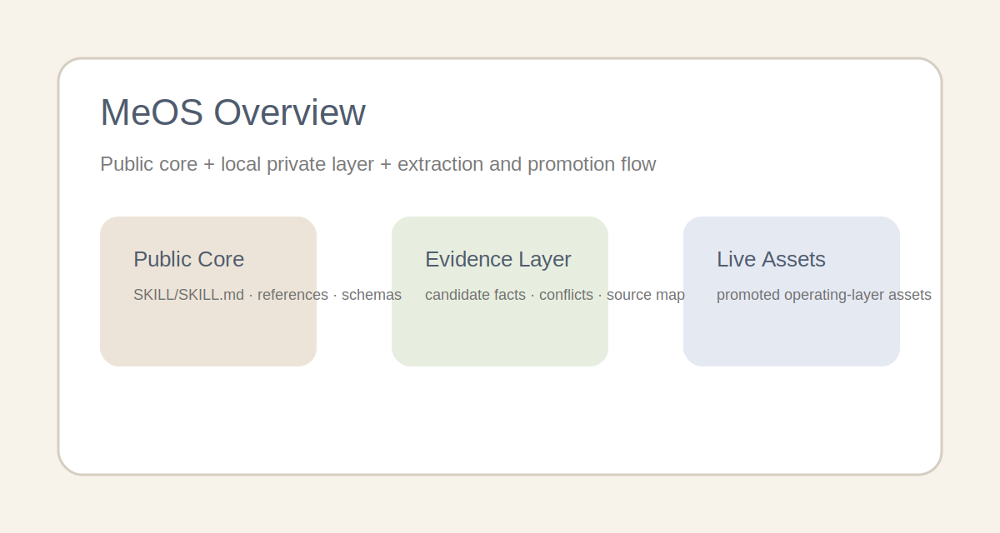
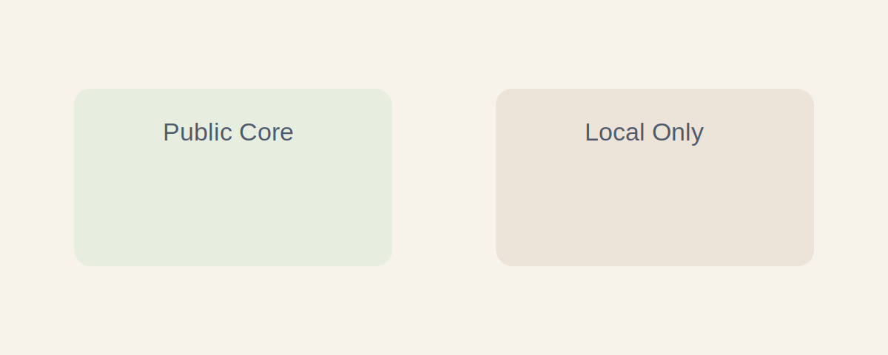

<h1 align="center">
  
  MeOS
</h1>

<p align="center">
  MeOS 是一个本地优先的操作层，用来把你的工作流、技术标准、偏好和纠偏规则整理成可复用的 agent 资产。
</p>

<p align="center">
  它让 Codex、Claude Code、OpenCode 和 OpenClaw 更像“学会了你怎么工作”，同时默认把私有原始历史保留在本地。
</p>

<p align="center">
  <a href="https://github.com/ResearAI/MeOS">https://github.com/ResearAI/MeOS</a>
</p>

<p align="center">
  <a href="https://github.com/ResearAI/MeOS">GitHub</a> |
  <a href="README.md">English README</a> |
  <a href="#quick-start">快速开始</a> |
  <a href="#install-and-use">安装与使用</a> |
  <a href="#runtime-setup">运行时配置</a> |
  <a href="#repository-layout">仓库结构</a>
</p>

<p align="center">
  <a href="https://github.com/ResearAI/MeOS"></a>
  <a href="LICENSE"></a>
  
  
</p>

<p align="center">
  <strong>不只是存储，而是实际应用</strong> ·
  <strong>公开仓库，私有本地层</strong> ·
  <strong>可编辑资产，不是黑箱记忆</strong> ·
  <strong>一套安装器覆盖多个运行时</strong>
</p>

<p align="center">
  <a href="#what-you-actually-get">能得到什么</a> •
  <a href="#how-meos-works">工作方式</a> •
  <a href="#promotion-and-privacy-rules">晋升与隐私规则</a> •
  <a href="#key-skill-references">关键 Skill 参考</a>
</p>



MeOS 不是 memory dump。  
不是角色扮演 prompt 包。  
也不是一堆零散提示词。

它是一个文件优先的系统，用来把“一个人的稳定工作方式”沉淀成未来 agent 真能用起来的资产。

支持 Codex、Claude Code、OpenCode 和 OpenClaw。

如果你已经厌倦了在每个新 agent 会话里重复解释同一套标准、同一种审美、同一类纠偏规则，MeOS 就是把这些重复劳动变成长期本地资产的那一层。

## ✨ 为什么是 MeOS

这一类系统通常各自只擅长一个点：

- 把一个人蒸馏成一段 prompt
- 从历史交互里抽技能
- 保留一批可复用的说明文档

MeOS 关注的是中间那层更长期、更稳定的“操作层”。

| 常见做法 | 常见问题 | MeOS 的做法 |
|---|---|---|
| Memory dump | 噪声太多，复用性弱 | 只把稳定模式晋升成资产 |
| Persona prompt | 听起来像你，但工作层很浅 | 直接存工作流、标准、原则和纠偏 |
| 一次性画像总结 | 很快过时 | 把 `init`、`refresh`、`apply` 做成长期生命周期 |
| 本地私人笔记 | 难以跨工具复用 | 用通用 `SKILL.md` 结构让多个运行时可加载 |

核心思想很简单：

> 不只是记住这个人，而是让这个人变得可复用

<a id="what-you-actually-get"></a>
## 🧩 你实际会得到什么

| 资产类型 | 例子 | 改善什么 |
|---|---|---|
| `🛠` 工作标准 | 编码规则、review 标准、验收线 | 技术质量与一致性 |
| `🧭` 工作流资产 | debug 顺序、架构评审顺序、交付清单 | agent 处理任务的方式 |
| `🧠` 思维风格 | 推理模式、权衡习惯、决策风格 | 规划与判断质量 |
| `🎨` 审美与偏好 | 输出结构、UI 审美、表达风格 | 最终结果的样子 |
| `✍️` 纠偏规则 | 明确 override、历史否定过的东西 | 减少重复偏航 |
| `📚` 知识资产 | 稳定事实、领域理解、可复用经验 | 超出单次聊天的上下文积累 |

<a id="how-meos-works"></a>
## ⚙️ MeOS 如何工作

| 模式 | 目的 | 先读什么 | 会写回什么 |
|---|---|---|---|
| `🧱 init` | 从批准过的本地材料建立第一版资产 | source policy、extraction SOP、promotion policy、privacy policy | 初始资产和 evidence |
| `🔁 refresh` | 用新增材料更新已有资产 | extraction SOP、promotion policy、correction policy | merge 后的更新、冲突、纠偏 |
| `🎯 apply` | 在真实任务里使用已有资产 | 只读取最相关的资产 | 只有稳定新信息才写回 |

`apply` 是最关键的模式。  
这也是 MeOS 从“档案”变成“真正有用”的地方。

<a id="quick-start"></a>
## 🚀 Quick Start

### 最快路径：直接从 npm 安装

```bash
npm install -g @researai/meos
meos install --runtime codex
meos doctor
```

然后直接开始用：

```text
Use meos in apply mode for this task. Read only the minimum relevant assets and use them to shape reasoning, workflow, and output.
```

### 仓库开发路径：clone 后本地安装

```bash
git clone https://github.com/ResearAI/MeOS.git
cd MeOS
bash install.sh --runtime codex
python3 installer.py doctor
```

<a id="install-and-use"></a>
## 📦 安装与使用

### 从 npm 安装

如果你只是想直接使用 MeOS，推荐这一条：

```bash
npm install -g @researai/meos
```

核心命令：

| 命令 | 作用 |
|---|---|
| `meos install --runtime codex` | 安装到 Codex |
| `meos install --runtime claude` | 安装到 Claude Code |
| `meos install --runtime openclaw --force` | 安装到 OpenClaw |
| `meos install --runtime opencode` | 安装到 OpenCode |
| `meos doctor` | 检查仓库和安装目标路径 |
| `meos print-prompts --lang en` | 打印英文 init / refresh / apply prompt |
| `meos print-prompts --lang zh` | 打印中文 init / refresh / apply prompt |

### 从仓库安装

如果你要开发 MeOS 自己，再走这一条：

安装器不会把整个仓库塞进运行时。  
它真正安装的是 `./SKILL/` 的内容，目标目录是运行时里的 `meos/`。

默认模式是 `--mode auto`。  
它会用更安全的运行时策略：

- 从 npm 安装的打包版本会默认使用 `copy`，避免把可变本地资产写进 `node_modules`
- 从本地仓库安装时，OpenClaw 默认用 `copy`，其他运行时默认 `symlink`

| 运行时 | 推荐命令 | 说明 |
|---|---|---|
| Codex | `bash install.sh --runtime codex` | 最简单的本地 skill 使用路径 |
| Claude Code | `bash install.sh --runtime claude` | 注意 skill 目录名必须是小写 `meos` |
| OpenClaw | `bash install.sh --runtime openclaw --force` | 更推荐复制目录 |
| OpenCode | `bash install.sh --runtime opencode` | 只安装到一个兼容路径即可 |

也可以使用 npm 包装器：

```bash
npm install -g @researai/meos
meos install --runtime codex
```

如果你是在本地开发当前仓库，也可以这样装：

```bash
npm install -g .
```

### 常见安装目标

| 运行时 | 推荐命令 | 说明 |
|---|---|---|
| Codex | `meos install --runtime codex` | 最简单的本地 skill 使用路径 |
| Claude Code | `meos install --runtime claude` | 注意 skill 目录名必须是小写 `meos` |
| OpenClaw | `meos install --runtime openclaw --force` | 更推荐复制目录 |
| OpenCode | `meos install --runtime opencode` | 只安装到一个兼容路径即可 |

如果你是在替换旧安装而不是第一次安装，请加 `--force`。

### 在真实任务中使用 MeOS

三种核心模式：

| 模式 | 什么时候用 | Prompt |
|---|---|---|
| `init` | 建第一版资产 | `Use meos in init mode. Build the first sanitized operating-layer assets from the available local source material.` |
| `refresh` | 更新已有资产 | `Use meos in refresh mode. Refresh the existing MeOS assets from new local material and only promote stable rules.` |
| `apply` | 在工作中使用资产 | `Use meos in apply mode for this task. Read only the minimum relevant assets and write back only stable new information.` |

### 按运行时的使用示例

Codex：

```text
Use meos in apply mode for this task. Read only the minimum relevant assets and use them to shape reasoning, workflow, and output.
```

Claude Code：

```text
/meos
Apply MeOS for this task. Read only the minimum relevant assets and use them to shape reasoning, workflow, and output.
```

<a id="runtime-setup"></a>
## 🖥 运行时配置

### Codex

Codex 支持 `.agents/skills/` 和 `~/.agents/skills/` 这类 skill 目录。

手工安装：

```bash
mkdir -p ~/.agents/skills
ln -s /path/to/MeOS/SKILL ~/.agents/skills/meos
```

Codex 可以显式通过名字触发 MeOS，也可以通过 skill 的 `description` 隐式选择它。

### Claude Code

Claude Code 支持 `~/.claude/skills/<skill-name>/SKILL.md` 和 `.claude/skills/<skill-name>/SKILL.md`。

手工安装：

```bash
mkdir -p ~/.claude/skills
ln -s /path/to/MeOS/SKILL ~/.claude/skills/meos
```

常见用法：

```text
/meos
Apply MeOS for this task. Read only the minimum relevant assets and use them to shape reasoning, workflow, and output.
```

### Claude Code + MiniMax

如果你要让 Claude Code 走 MiniMax 的 Anthropic 兼容端点，本地 `~/.claude/settings.json` 可以这样写：

```json
{
  "env": {
    "ANTHROPIC_BASE_URL": "https://api.minimaxi.com/anthropic",
    "ANTHROPIC_AUTH_TOKEN": "${MINIMAX_API_KEY}",
    "API_TIMEOUT_MS": "3000000",
    "CLAUDE_CODE_DISABLE_NONESSENTIAL_TRAFFIC": "1"
  }
}
```

验证：

```bash
claude -p --model MiniMax-M2.7 'Respond with exactly CLAUDE_MINIMAX_OK.'
```

### OpenClaw

OpenClaw 支持 `~/.openclaw/skills`、`~/.agents/skills`、`<workspace>/.agents/skills` 和 `<workspace>/skills`。

手动测试确认过的关键行为：

- OpenClaw 会跳过真实路径逃离配置根目录的 symlink skill
- 外部 symlink 安装并不稳
- 最稳妥的是把 `meos` 作为真实目录复制到 `<workspace>/skills/meos` 或 `~/.openclaw/skills/meos`

推荐手工安装：

```bash
mkdir -p <workspace>/skills
cp -a /path/to/MeOS/SKILL <workspace>/skills/meos
```

验证：

```bash
openclaw skills info meos
openclaw skills list | rg meos
```

### OpenCode

OpenCode 会搜索多个兼容 skill 目录：

- `.opencode/skills/<name>/SKILL.md`
- `~/.config/opencode/skills/<name>/SKILL.md`
- `.claude/skills/<name>/SKILL.md`
- `~/.claude/skills/<name>/SKILL.md`
- `.agents/skills/<name>/SKILL.md`
- `~/.agents/skills/<name>/SKILL.md`

只选一个路径安装即可：

```bash
mkdir -p ~/.config/opencode/skills
ln -s /path/to/MeOS/SKILL ~/.config/opencode/skills/meos
```

如果你的 provider 或代理不支持 OpenCode 默认用来生成标题的副模型，请显式设置 `small_model`：

```json
{
  "$schema": "https://opencode.ai/config.json",
  "model": "openai/gpt-5.4",
  "small_model": "openai/gpt-5.4"
}
```

验证：

```bash
opencode run --model openai/gpt-5.4 --format json \
  'Use meos in apply mode for this task. Reply with exactly OPENCODE_SKILL_OK.'
```

## 🗂 `apply` 模式下 agent 会读什么

下面这些路径都相对于安装后的 skill 根目录。  
在当前仓库里，它们实际位于 `SKILL/` 下。

| 任务类型 | 优先读什么 | 会带来什么 |
|---|---|---|
| `🛠` 技术实现 | `assets/live/work/`、`assets/live/thought-style/`、`assets/live/workflow/`、`assets/live/principles/` | 更贴近你的技术标准和执行顺序 |
| `🎨` UI / 产品 | `assets/live/taste/`、`assets/live/work/`、`assets/live/workflow/`、`assets/live/corrections/` | 更贴近你的审美和呈现要求 |
| `🔬` 研究 / 写作 | `assets/live/work/`、`assets/live/thought-style/`、`assets/live/principles/`、`assets/live/knowledge/`、`assets/live/workflow/` | 更贴近你的结构、推理和知识组织方式 |
| `💬` 风格敏感回复 | `assets/live/preferences/`、`assets/live/corrections/` | 更贴近你的表达形态和措辞习惯 |

如果 `assets/live/corrections/` 和其他层冲突，以 correction 为准。

<a id="promotion-and-privacy-rules"></a>
## 🔒 晋升与隐私规则

### 晋升流程

1. 收集本地材料
2. 判断来源类型
3. 提取高信号候选事实
4. 不确定内容先放到 `evidence/`
5. 只有稳定规则才晋升到 `assets/live/`

适合晋升的情况：

- 用户明确说过
- 在多个上下文里重复出现
- 被用户明确纠正或强化过

只该留在 `evidence/` 的情况：

- 一次性行为
- 噪声较大
- 过度依赖上下文
- 太敏感

### 维护生命周期

MeOS 的维护动作应该是：

- add
- merge
- downgrade
- discard

重点不是堆越来越多 prompt，而是让资产层保持干净、可维护。

### 隐私边界

| 可公开内容 | 默认保留在本地 |
|---|---|
| `README.md` | `SKILL/private/` |
| `README_ZH.md` | `SKILL/evidence/` |
| `assets/branding/` | `SKILL/runtime/` |
| `assets/readme/` | `SKILL/assets/live/` |
| `SKILL/references/` | 原始导入材料 |
| `SKILL/schemas/` | secrets 和 tokens |
| `SKILL/assets/templates/` | 工作站本地备注 |
| `SKILL/assets/examples/` | 私有原始对话 |

不要提交：

- token
- API key
- 个人身份标识
- 原始 connector id
- 不必要的私有路径
- 私有原始对话



<a id="repository-layout"></a>
## 🏗 仓库结构

```text
MeOS/
├── README.md
├── README_ZH.md
├── LICENSE
├── assets/
│   ├── branding/
│   └── readme/
├── SKILL/
│   ├── SKILL.md
│   ├── references/
│   ├── schemas/
│   ├── assets/
│   │   ├── templates/
│   │   ├── examples/
│   │   └── live/
│   ├── evidence/
│   ├── runtime/
│   └── private/
├── install.sh
├── installer.py
├── package.json
└── bin/
```

关键结构就是：

- 仓库根目录放公开项目材料
- 运行时真正需要的 skill 内容都放在 `SKILL/`
- 安装器负责把 `SKILL/` 安装进运行时 skill 目录
- 本地 owner 校准层保留在 `SKILL/assets/live/`、`SKILL/evidence/`、`SKILL/private/` 和 `SKILL/runtime/`

<a id="key-skill-references"></a>
## 📌 关键 Skill 参考

`SKILL/` 里最值得先看的文件是：

- [SKILL/SKILL.md](SKILL/SKILL.md)
- [SKILL/references/source-locations.md](SKILL/references/source-locations.md)
- [SKILL/references/extraction-sop.md](SKILL/references/extraction-sop.md)
- [SKILL/references/promotion-policy.md](SKILL/references/promotion-policy.md)
- [SKILL/references/privacy-policy.md](SKILL/references/privacy-policy.md)
- [SKILL/references/writeback-policy.md](SKILL/references/writeback-policy.md)
- [SKILL/references/apply-task-map.md](SKILL/references/apply-task-map.md)

## 🛤 当前方向

MeOS 现在已经有：

- 一套跨运行时的 `SKILL/` 包布局
- extraction、promotion、privacy、writeback 参考文档
- durable entry 的 JSON schema
- example 和 template 资产树
- 面向 Codex、Claude Code、OpenCode、OpenClaw 的安装路径

下一步不应该是“继续堆 prompt 文本”。  
而是继续完善资产、示例和公开展示，同时不泄露任何私有历史。

## 📚 引用

如果 MeOS 被用于人格对齐、风格蒸馏或长期操作层资产维护相关工作，也可以考虑引用：

```bibtex
@inproceedings{
zhu2025personality,
title={Personality Alignment of Large Language Models},
author={Minjun Zhu and Yixuan Weng and Linyi Yang and Yue Zhang},
booktitle={The Thirteenth International Conference on Learning Representations},
year={2025},
url={https://openreview.net/forum?id=0DZEs8NpUH}
}
```
